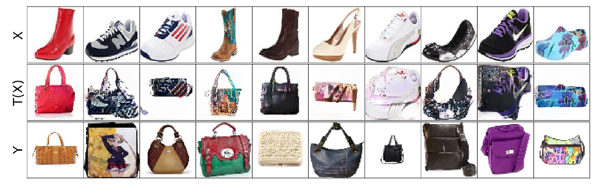
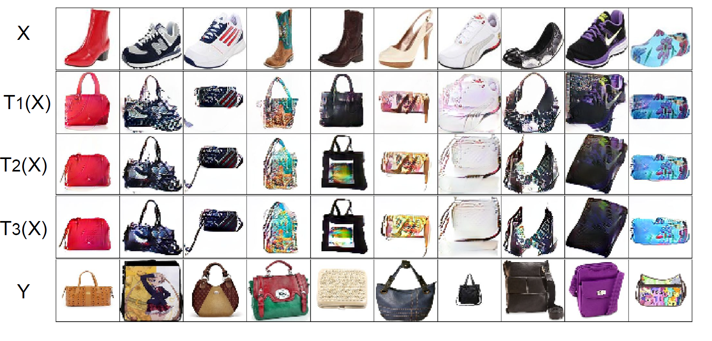

# Stacking for improving neural optimal transport based style-transfer models

The repository contains code implemintaion of the final project of Skoltech Machine Learning 2023 course. The implementaion is based on [Neural Optimal Transport](https://openreview.net/forum?id=d8CBRlWNkqH) work of Korotin A. et al. and its [PyTorch implementation](https://github.com/iamalexkorotin/NeuralOptimalTransport). 

## Application of Stacking for improving neural optimal transport based style-transfer models

### Problem statment 
The NOT approach can be applied to style transfer problem as it shown on the following picture. However, the mapped data contains some artefacts for example purple shoe to bag transfer. 
<p align="center"></p>

Thus, we apply stacking approach to improve the quality of the generated images. The quality of images estimated as FID metric.

### Datasets and preprocessing

Two unpaired [datasets](https://github.com/junyanz/iGAN/blob/master/train_dcgan/README.md) were used bags and shoes with 64x64 RGB images. Statistics calculates via ```culc_init_stats.py```. To create a new dataset from the trained NN and the existing dataset ```mapping.py``` was used. 

### Example of the results

The example of images produced in a result of the stacking are presented in the following picture. A more complete description of the results can be find in the ```report.pdf``` file.

<p align="center"></p>

## Repositiry structure and instructions for the code use
### Structure
The repository contains supporting functions in ```src/```. The ```notebooks/``` contains two notebooks for explanation of the NOT process (```NOT_training_strong.ipynb```) and combination of NOT and stacking process (```NOT_training_stacking.ipynb```). Also, the root folder contains three python scripts for preprocessing (```culc_init_stats.py```), application of the trained NN for creating new data set for the next iteration (```mapping.py```) and training of NN on a new data set (```training.py```).

### Instructions
###### Python scripts for local machines
For the first iteration of stacking the running order should be as follows  ```culc_init_stats.py``` -> ```training.py```. Next iterations of the stacking requires the scripts to be runned in the following order ```mapping.py``` -> ```training.py```. Modification of the input data sets is required in the mentioned scripts. [Weights & Biases](https://wandb.ai) were used, thus prior login requires.

###### Notebooks for Collab
The self explanatory notebook can be find ```notebooks/NOT_training_stacking.ipynb```.

## Requirements
The code was tested in the premium collab enviroment. The `torch== 1.9.0` version were used. The other used libraries were the latest update on the data of `24.03.2022`.

## Credits
- [NeuralOptimalTransport](https://github.com/iamalexkorotin/NeuralOptimalTransport) Github Repo of the Neural Optimal Transport article Korotin et al.;
- [ADASE Group](https://github.com/adasegroup) for the great ML course;
- [Weights & Biases](https://wandb.ai) developer tools for machine learning;